# Filtrage Réseau avec iptables 
Travaux Pratiques du cours 5ièm année Génie Logiciel portant sur les Opérations des chaines et des tables `filter`.
## Pré-requis :
* Terminal :  Kali Linux Command Line
* iptables : versions `2.4.x` et ultérieures.

---

# Qu'est-ce que iptables ?
* `iptables` est un logiciel libre de l'espace utilisateur Linux grâce auquel l'administrateur système peut configurer les chaînes et règles dans le pare-feu en espace noyau

* Iptables est une interface en ligne de commande permettant de configurer le `Netfilter` (cadriciel implémentant un pare-feu ,écrit en langage C, au sein du noyau Linux à partir de la version 2.4 de ce dernier).
## Pourquoi utiliser iptables ?

Le pare-feu Iptables Linux est utilisé pour surveiller le trafic entrant et sortant vers un serveur et le filtrer en fonction des règles définies par l'utilisateur, afin d'empêcher toute personne d'accéder au système.

schema firewall/routeur

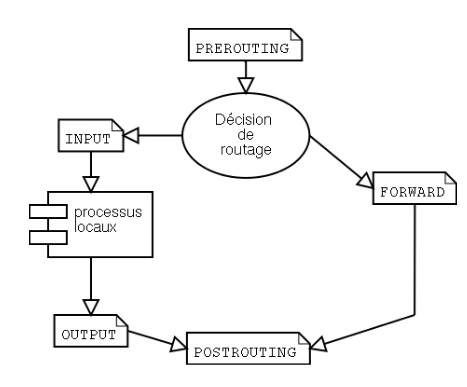
## Les tables (iptables -t)
Netfilter possède 3 tables de bases :

* filter (iptables)
* nat
* mangle

## Les chaines (iptables -L)
Chacune des tables possèdent des chaînes prédéfinies :

* INPUT
* FORWARD
* OUTPUT
* PREROUTING
* POSTROUTING

### Filter : INPUT, OUTPUT, FORWARD
Cette table permet de faire des opérations de filtrage, ce qui est le plus courant avec iptables, à tel point que c'est la table utilisée par défaut :
Filter correspond à 3 type de chaines :

**INPUT** (chaîne d'entrée):

Cette chaîne est utilisée pour contrôler le comportement des connexions entrantes. Par exemple, si un utilisateur tente de se connecter en SSH sur PC/serveur, iptables tentera de faire correspondre l'adresse IP et le n° de port à une règle de la chaîne d'entrée.

**OUTPUT** (chaîne de sortie):

Cette chaîne est utilisée pour les connexions émisent par la machine en guise de réponse à une requête reçue en INPUT.

**FORWARD** (chaîne de transfert):

 Cette chaîne est utilisée pour les connexions entrantes qui ne sont pas réellement livrées localement. Pensez à un routeur – les données lui sont toujours envoyées mais rarement destinées au routeur lui-même ; les données sont simplement transmises à leur cible.

## Que puis-je faire avec iptables/netfilter ? 

on utilise iptables/netfilter pour configurer le pare-feu de la c'est - à dire 
* On bloque tout le trafic entrant par défaut.
* On autorise au cas par cas : le trafic appartenant ou lié à des connexions déjà établies et le trafic à destination des serveurs (web, ssh, etc.) que nous souhaitons mettre à disposition.

Ce qui concrêtement se traduit par :

* Autoriser le trafic entrant d'une connexion déjà établie
* Permettre le trafic entrant sur un port spécifique
* Bloquer le trafic
* Autoriser le trafic local
* Autoriser les requêtes ICMP (ping)
* Supprimer une règle
* Sauvegarder des règles

## Comment placer une règle dans une chaîne ?

**Syntaxe**: `iptables [-t table] -[AIDFP] CHAINE(INPUT|OUTPUT|FORWARD) rule-specification [options]`

* `-A` pour **append** : rajouter une règle à la suite des autres(la première règle passé par -A se
retrouve en première position, les suivantes se retrouve à la suite)

* `-I` pour **insert** : rajoute une règle qui vient se placer avant toutes les autres(en haut de la pile)
* `-D` pour **delete** : effacer une règle
  * `-D numerox` : effacer la règle numéro x
  * `-D règle`: efface la règle
* `-F` pour **flush** : on obtient le même résultat en effaçant toutes les règles une par une
* `-P`  pour **policy** : sert à fixer les policy par défaut, c'est à dire à fixer l'action à prendre par défaut(quand aucune règle n'est matché). 

La premier paramètre à connaître est le paramètre -j, car c'est avec celui-ci que l'on va dire quoi
faire lorsqu'un paquet match la règle que l'on écrit. Le paramètre -j s'utilise de la manière suivante :
* `-j target(cible)`
Ainsi une règle basique sera de la forme :
`iptables -A chaîne -j target`

## Comportement par défaut de la chaîne de stratégie (POLICY)
Avant d'entrer et de configurer des règles spécifiques, on doit décider quel sera le comportement par défaut des trois chaînes. En d'autres termes, ce qu'il faut qu'iptables fasse si la connexion ne correspond à aucune règle existante ?

`iptables --policy(ou -p) CHAINE(INPUT|OUTPUT|FORWARD) [ ACCEPT | DROP | REJECT ]` :
* `ACCEPT`: laisser passer le paquet (totalité des paquets envoyés sont reçus)
* `DROP` : refuser le paquet sans réponse (totalité des paquets envoyés sont perdus)
* `REJECT` : refuser la paquet avec une réponse (totalité des paquets envoyés sont réçu mais pas exécutés)
[ par défaut il existe une cible `QUEUE` et `RETURN`] 

N.B: avant de commencer de faire toute manip, il faut prendre soin de couper tout service qui pourrait modifier les règles iptables(`/etc/init.d/service stop`, où service peut être iptables,shorewall etc).

commande line : 

liste des règles de la chaine INPUT

`iptables -L INPUT`

**syntax**: iptables -L -[ m | v | mv ]

`iptables -L OUTPUT -m -v`

# Pratique du Filtrage avec iptables sur Kali Linux 

 

##  Kali Linux 
Se connecter sur le terminal Kali linux en tant qu'administrateur
* Login root : `sudo su`
* Vérifier que je suis bien le root : `whoami`
* Vérifier que iptables est bien installé : `iptables --version`
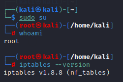

## Opérations sur une seule chaîne et sur la table filter: 

* **Première règle**

Interdire tout paquet entrant

`iptables -A INPUT -j DROP`

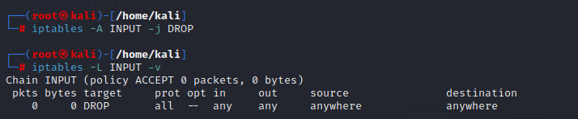

Effacer la règle 

`iptables -D INPUT 1`
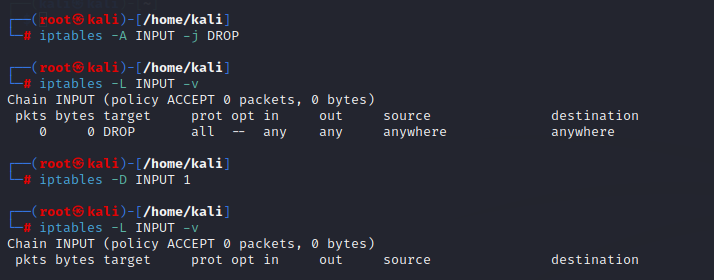

* **paramètre protocole** 
  
Interdire le protocole ICMP entrant

`iptables -A INPUT -p icmp -j DROP`

-p : protocol ip pour une règle(icmp, tcp, udp, ou all)  
on a bien envoyer un ping sur l'adresse de notre machine dans laquelle on a établit notre regles les paquets envoyés n'ont pas été reçu.

Effacer la règle

`iptables -D INPUT 1`

**paramètre source** 

Interdire le protocole ICMP provenant de localhost 

`iptables -A INPUT -p icmp -s localhost -j DROP`

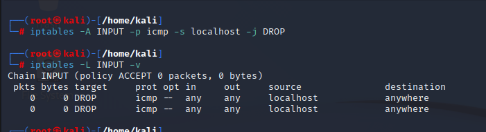
  * -p : protocole

  * -s : source 

Effacer la règle
`iptables -D INPUT `

* **chaîne OUTPUT paramètre destination** 

Interdire tout paquet sortant à destination de localhost 

`iptables -A OUTPUT -d localhost -j DROP`
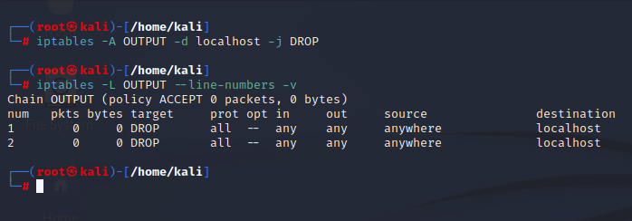

-d : destination

Effacer la règle 
`iptables -D OUTPUT 1`

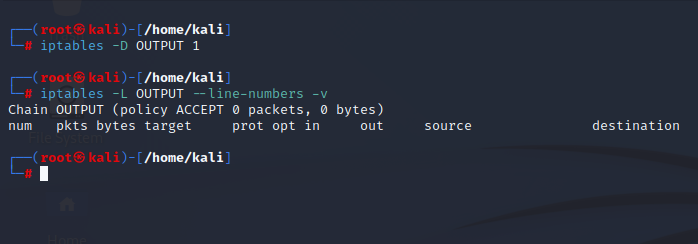

* **paramètre inversion** 
  
Interdire un paquet s'il ne provient pas de localhost 

`iptables -A INPUT -s ! localhost -j DROP`

* **paramètre interface d'entrée** 
  
Interdire tout paquet entrant s'il provient de lo (à ne surtout jamais faire sur une machine si l'on 
ne sait pas EXACTEMENT ce que l'on fait)

`iptables -A INPUT -i lo -j DROP`

* **paramètre interface de sortie** 
  
Interdire tout paquet sortant par eth0 

`iptables -A OUTPUT -o eth0 -j DROP`

* -o : --out-interface 

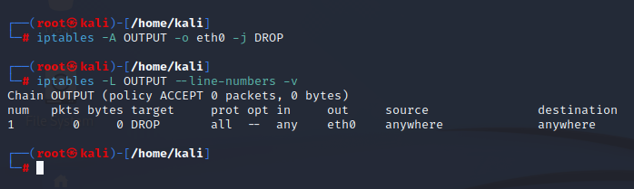

* **paramètre destination port** 

Interdire tout paquet sortant à destination du port ftp 

`iptables -A OUTPUT -p tcp --dport 21 -j DROP`

* la communication FTP s'effectue via le port 21
* --dport : --destination-ports

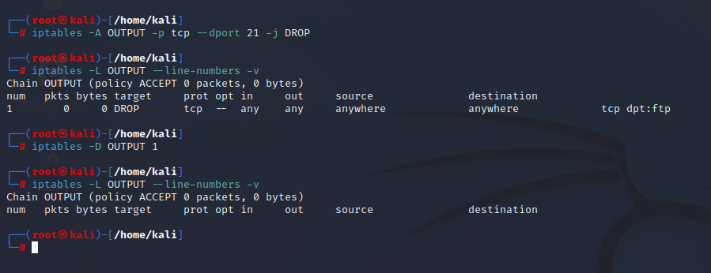

* **paramètre source port** 

Interdire tout paquet sortant par eth0 dont le numéro de port destination est inférieur à 1025 

`iptables -A OUTPUT -o eth0 -p tcp --sport:1024 -j DROP`
`iptables -A OUTPUT -o eth0 -p udp --sport:1024 -j DROP`

* --sport : --source-ports
* --sport:1024 : tous les port jusqu'au port 1024

* **paramètre flag TCP** 
  
Interdire toute tentative d'initialisation de connexion TCP provenant de eth0 

`iptables -A INPUT -i eth0 -p tcp --syn -j DROP`

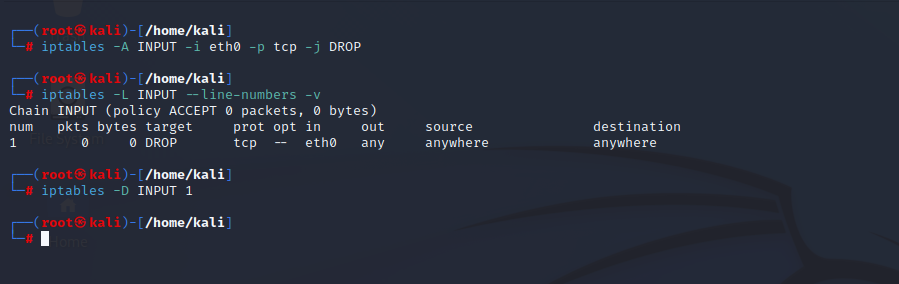

* **paramètre flag icmp** 

Interdire tout paquet entrant correspondant à un ping 

`iptables -A INPUT -p icmp --icmp-type echo-request -j DROP`

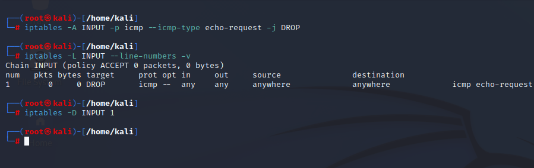

Interdire toute réponse à un ping 

`iptables -A INPUT -p icmp --icmp-type echo-reply -j DROP`

# Liens utiles:
* [www.netfilter.org](https://www.netfilter.org/projects/iptables/index.html)
* [doc.ubuntu-fr.org](https://doc.ubuntu-fr.org/iptables)
* [connect.ed-diamond.com](https://connect.ed-diamond.com/GNU-Linux-Magazine/glmfhs-041/introduction-a-netfilter-et-iptables)
* [www.howtogeek.com](https://www.howtogeek.com/177621/the-beginners-guide-to-iptables-the-linux-firewall/)